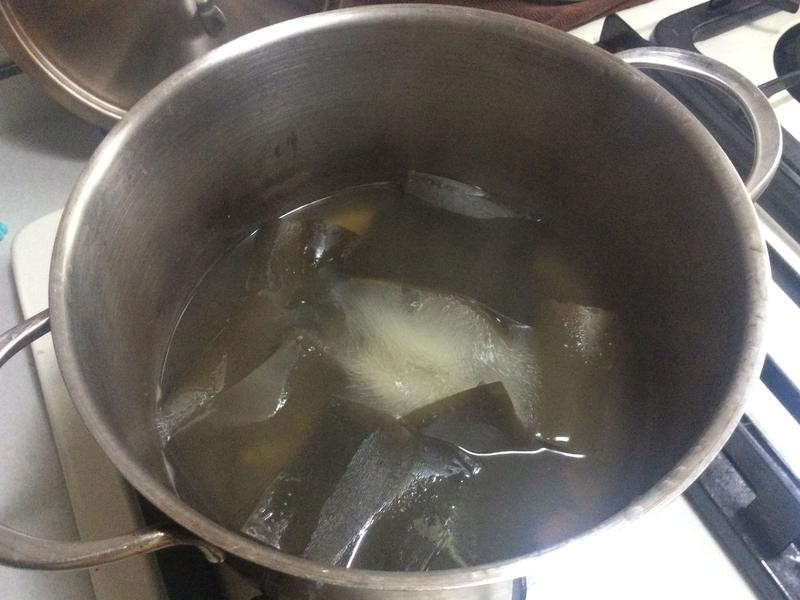

# 茶泡飯

## 準備物品、食材:

**（ 2 人份）**

• 昆布 / 1 段（約15cm）

• 日式煎茶包或抹茶茶包 / 2 包

• 白飯 / 2 小碗

• 現磨新鮮芥末 / 適量

• 海鹽 / 少許

• 味付海苔 / 8 片

• 日本梅干 / 2 顆

• 白芝麻 / 1小匙

• 電磁爐 / 1 個

## **作法**

### Step 1 :

昆布用乾淨的濕布擦拭過，放在小鍋裡加入兩碗水浸泡三小時以上（夏日或隔夜請置冰箱）。

### Step 2 :

將作法1 煮至將滾沸前，撈出昆布，續煮至滾沸，放入茶包後熄火，以少許海鹽調味，飯湯完成。

### Step 3 :

將飯盛好，鋪上剪成絲的海苔，梅干一顆（切碎比較不會太鹹），灑上白芝麻，在碗邊抹上適量的芥末，沖入煮沸的茶至飯的2/3 高度即成。

###  Step 4 :

