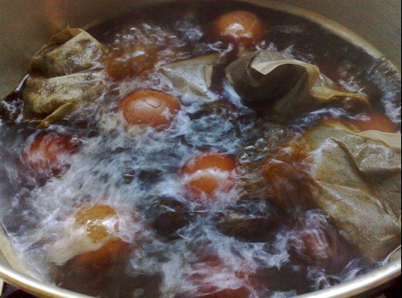
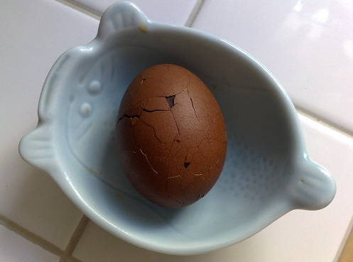

# 茶葉蛋

## 準備物品、食材 :

\( 多人份 \)

• 雞蛋 / 10 顆

• 茶葉蛋滷包 / 1 包

• 烏龍茶葉 / 少許

• 電磁爐 / 1 個

## **作法**

### Step 1 :

先把雞蛋洗乾淨放入鍋子，加水至蓋過雞蛋的高度，加入一湯匙鹽。

### Step 2 :

雞蛋煮熟後放入冷水中。

### Step 3 :

把冰鎮過的雞蛋蛋殼敲碎，這樣滷的茶葉蛋更容易入味。

### Step 4 :

等著雞蛋煮熟同時，可以用另一鍋水加入滷包、烏龍茶包，先熬煮。

### Step 5 :

把雞蛋丟入滷汁裡，滷汁要淹過雞蛋，加入醬油調味，滷一個小時後關火，用餘溫繼續滷泡，等涼了放入冰箱，第二天茶葉蛋就可以吃了。

### Step 6 :

鹹度一個人喜好調整，十顆蛋約六大湯匙醬油。

###  Step 7 :

