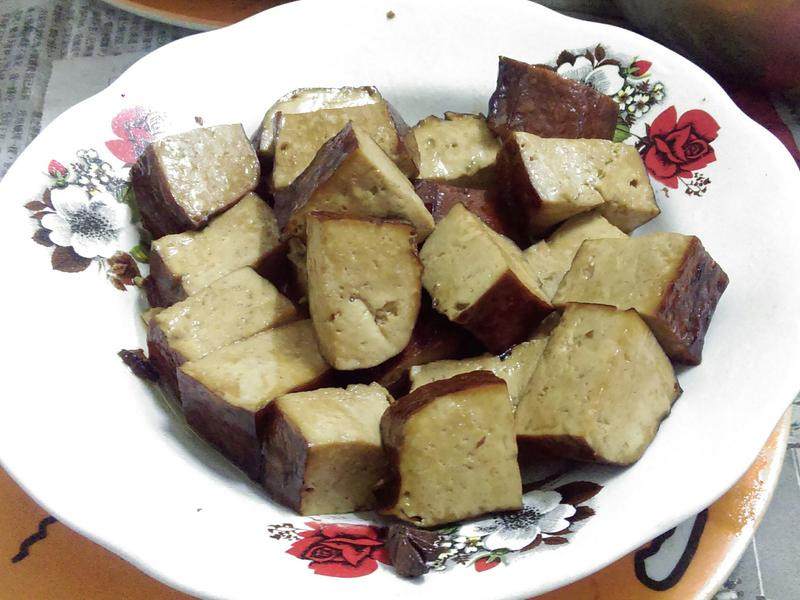
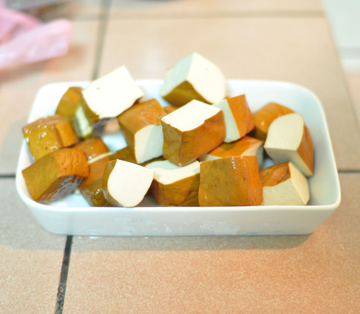

# 蜜汁滷豆干

## 準備物品、食材 :

\( 多人份 \)

• 豆乾 / 1 斤

• 醬油 / 1 碗 

• 冰糖 / 約 300 公克

• 沙拉油 / 半碗

• 八角 / 2 顆

• 滷味包 / 1 包

• 電鍋 / 1 個

## **作法**

### Step 1 :

把豆乾切成小方塊狀

### Step 2 :

再將所有材料丟入鍋子裡開始燉煮\(可用電磁爐\)

### Step 3 :

煮滾後\(冰糖全部融掉，醬油滾了\)，溫度降低在主30分鐘左右

### Step 4 :

如果想要讓豆乾更入味，可以放入電鍋繼續燉煮

###  Step 5 :

