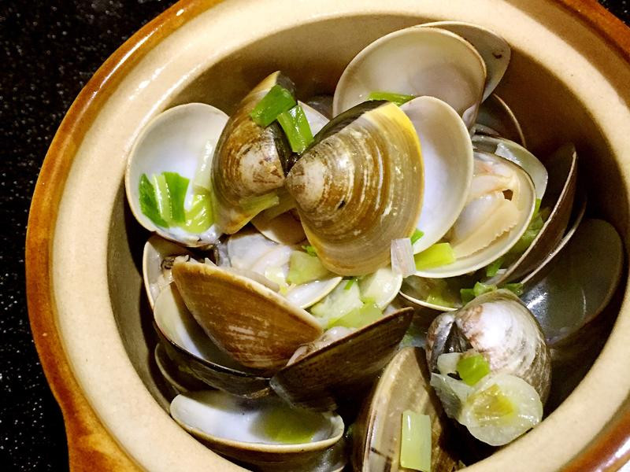
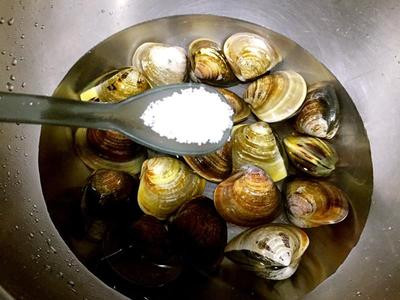

# 酒蒸蛤蜊

## 準備物品、食材:

\( 1 ~ 3 人份\)

• 蛤蜊 / 600 公克

• 大蒜 / 3 顆

• 辣椒 / 1 條

• 奶油 / 少許

• 米酒 / 30 cc

• 蔥 / 1 把

• 油 / 少許

• 電磁爐 / 1 個

## **作法**

### Step 1 :

加入適量的鹽，讓蛤蜊吐沙（水的份量大概淹過蛤蜊，鹽的份量大約水的2%～3%）

### Step 2 :

將蒜頭、薑與辣椒爆香

### Step 3 :

加入蛤蜊與米酒

### Step 4 :

蓋上鍋蓋

### Step 5 :

等待蛤蜊開後，可加入一點奶油

###  Step 6 :

