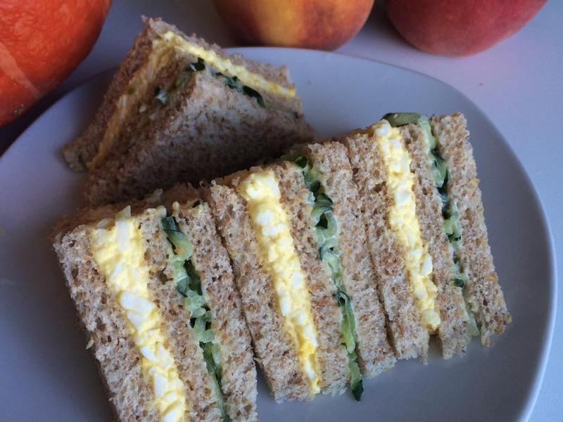
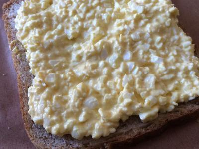

# 雞蛋沙拉三明治

## 準備物品、食材:

\( 1 ~ 2 人份\)

• 雞蛋 / 3 顆

• 吐司 / 6 片

• 胡椒 / 適量

• 小黃瓜 / 1 條

• 美乃滋 / 適量

• 鹽 / 適量

• 電磁爐 / 1 個

## **作法**

### Step 1 :

準備好食材，將雞蛋放入鍋中，由冷水開始煮，鍋中水滾後開始計時10分鐘，撈起泡冷水撥殼備用

### Step 2 :

小黃瓜刨絲，加入一點點的鹽拌一下，擠出多餘水分備用

### Step 3 :

將雞蛋用刀切碎，放在小攪拌盆中

### Step 4 :

加入適量美乃滋、胡椒粉拌勻。美乃滋量不要過多，否則會有些膩口

### Step 5 :

在吐司上鋪上希望的量

### Step 6 :

疊上第二片吐司，鋪上殺青後的小黃瓜，再鋪上最後一層吐司

###  Step 7 :

