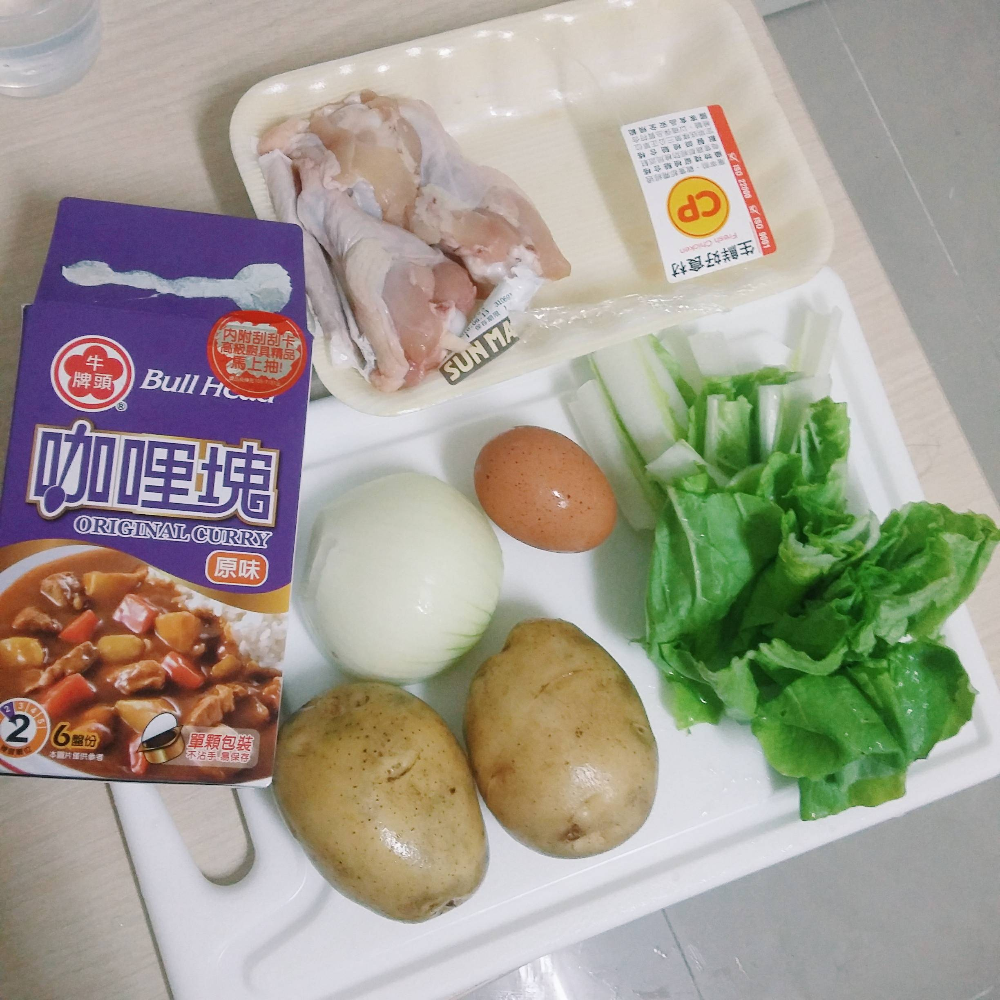
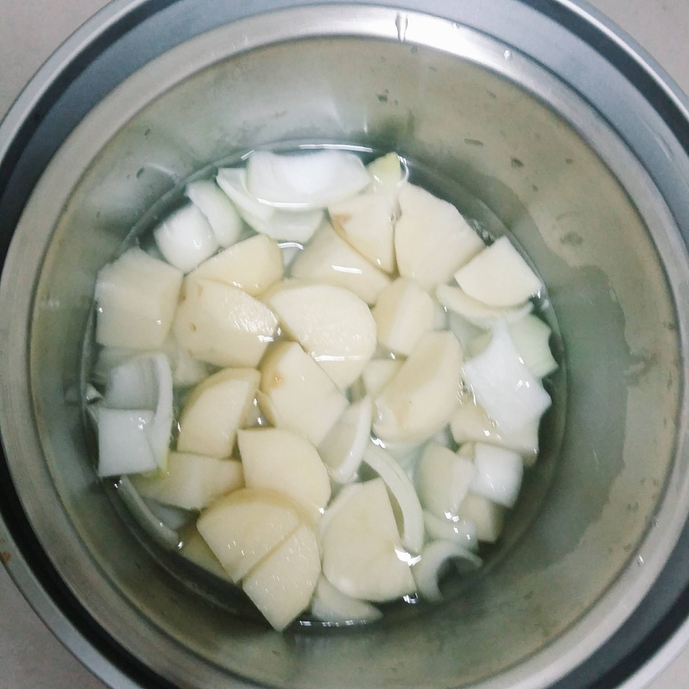
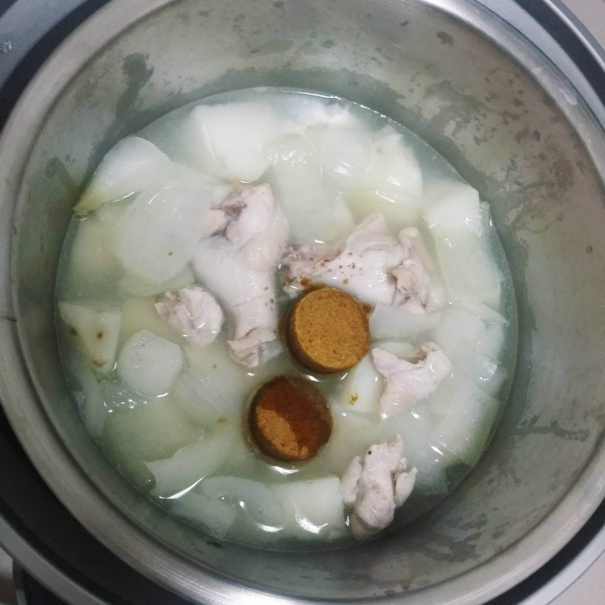
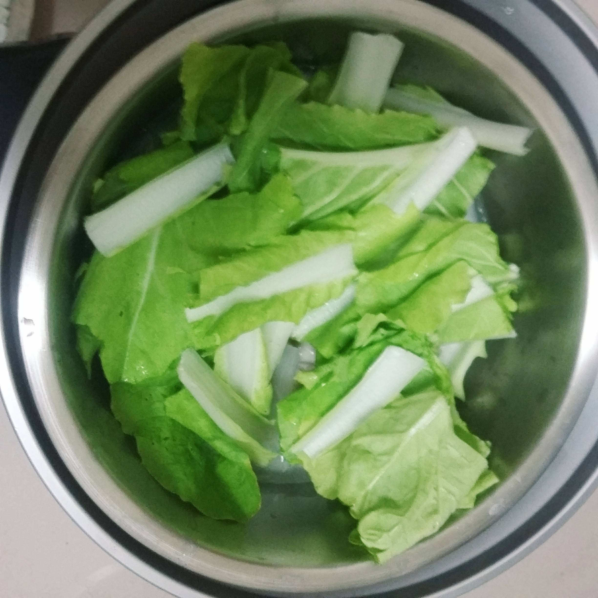
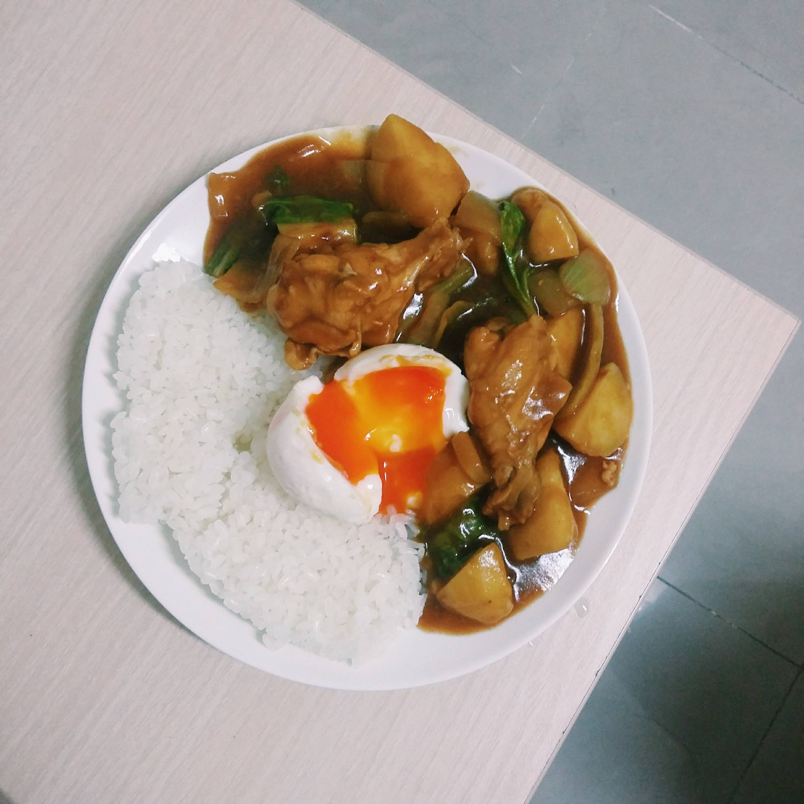

# 咖哩雞腿飯

## 準備物品、食材:

\( 多人份 \)

 • 電鍋 / 1 個

 • 白飯 / 1 碗

 • 洋蔥 / 1/2 顆

 • 馬鈴薯 / 2 顆

 • 雞蛋 / 1 顆

 • 小白菜 / 2 把

 • 雞腿肉  / 隨意（看你想吃多少肉）

 • 咖哩塊 / 2-3塊 （喜歡濃郁可以多加1-2塊）

## 作法

### Step 1 :

 首先先將食材切成適當大小

### Step 2 :

將洋蔥及馬鈴薯舖在鍋底內鍋倒入與食材同高的水量外鍋倒1.5杯水下去煮

### Step 3 :

 煮大約20分鐘時打開鍋蓋加入雞肉及咖哩塊，接著蓋上鍋蓋繼續煮 7-8分鐘

### Step 4 :

打開加入小白菜然後攪拌一下咖哩 讓咖哩塊能均勻融化，再蓋上鍋蓋悶10分鐘。

### Step 5 :

準備白飯和一顆水煮蛋，將完成的咖哩淋在上面就可以上菜囉!

### Step 6 :

營養又健康有簡易的咖哩飯完成啦～

蔬菜，蛋，肉，澱粉都有

吃不完可以冰在冰箱 下次再加熱就好再次加熱的馬鈴薯會變得入口即化

一定要試試!!

