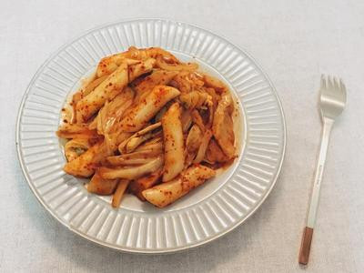

# 韓式辣炒年糕

## 準備物品、食材:

\(一人份\)

 • 年糕料理包 / 半包

 • 雞肉片 / 40 g

 • 高麗菜 / 3 大片

 • 甜不辣 / 1.5 片

 • 洋蔥 / 1/4 顆

 • 韓國粗粒辣椒粉 / 1 大匙

 • 水 / 150g

• 平底鍋 / 1 個

• 電磁爐 / 1 個

## 作法

### Step 1 :

  高麗菜撕成好入口大小、洋蔥切絲、甜不辣切段、雞肉切小片備用。

### Step 2 :

 依照年糕調理包上的指示，平底鍋中加水，放入年糕與調理包一同烹煮。

### Step 3 :

 大約煮到半熟時，加入其他配料下去拌炒，讓它慢慢收汁。

### Step 4 :

 看醬汁收得差不多以後，最後再加入一匙韓國辣椒粉拌炒均勻～（一匙其實蠻多的！怕辣的人可以斟酌）

### Step 5 :

裝盤上菜!!

### Step 6 :

這樣子辣呼呼的韓式辣炒年糕就完成囉！

簡單又好吃！

也可以加一顆水煮蛋

蛋黃配著辣醬吃真的很對味～

