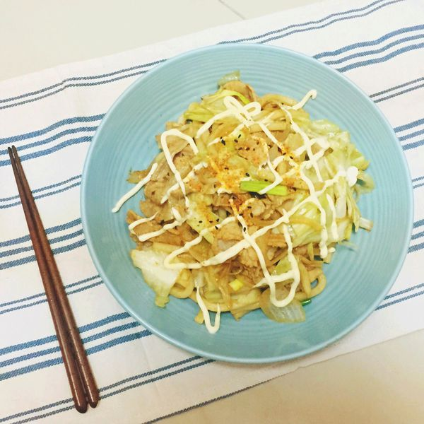
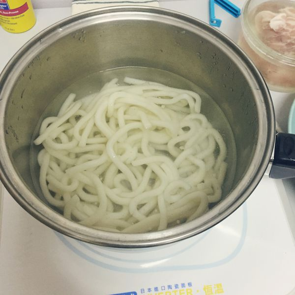
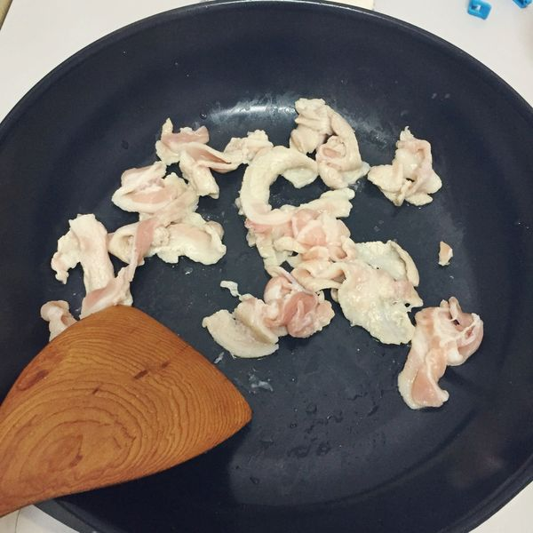
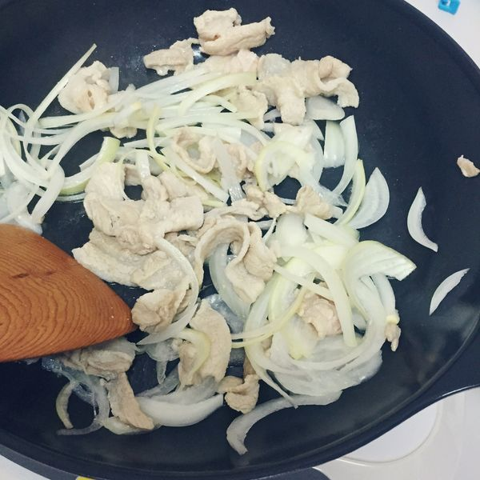
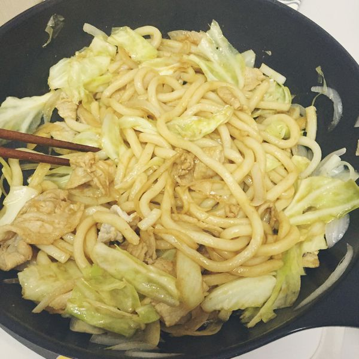
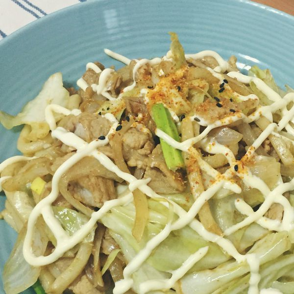

# 日式炒烏龍

## 準備物品、食材:

• 烏龍麵 / 1 包（冷凍冷藏的皆可）

• 豬肉片 / 35 g

• 洋蔥 / 1/3 ~ 1/4 顆

•  高麗菜 / 3 ~ 4 片 

• 日式炒麵香醋醬 / 1.5 ~ 2 大匙

• 鹽 / 少許

• 日式美乃滋 / 適量

• 七味粉 / 少許

• 青蔥 / 1 根

• 平底鍋 / 1 個

• 電磁爐 / 1 個

## 作法

### Step 1 :

 將烏龍麵依照包奘指示煮熟後撈起，放涼備用

豬培根切小塊、洋蔥切細絲、高麗菜撕成小片、青蔥切段狀備用

### Step 2 :

 鍋子加熱，放入豬肉片稍微拌炒逼出油脂

### Step 3 :

 加入洋蔥絲，拌炒至稍微透明

### Step 4 :

 再加入高麗菜拌炒一下後，加入烏龍麵

### Step 5 :

 加入日式炒麵香醋醬拌炒，記得嚐嚐味道，我覺得口感稍酸，所以再加了一點點鹽，讓烏龍麵都均勻沾上香醋醬以後，再加入蔥段快速拌炒，就可以準備起鍋。

### Step 6 : 

淋上美奶滋和七味粉提味，接著準備開動啦!

