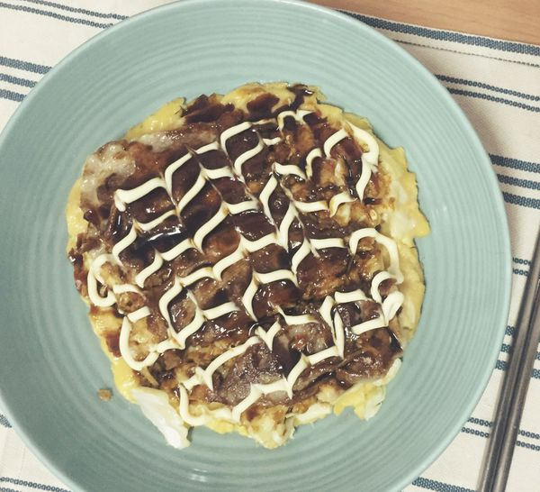
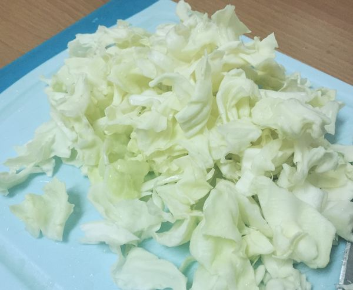
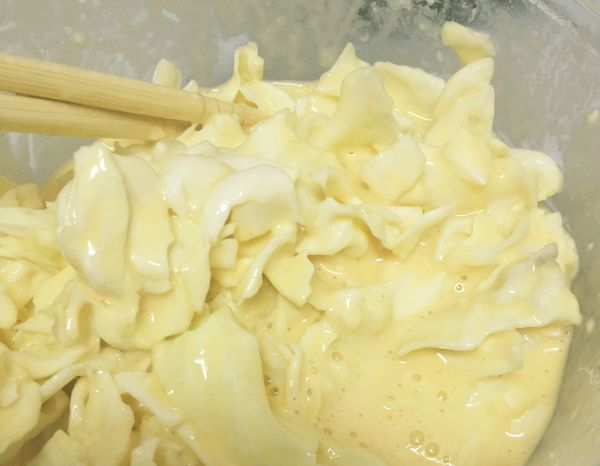
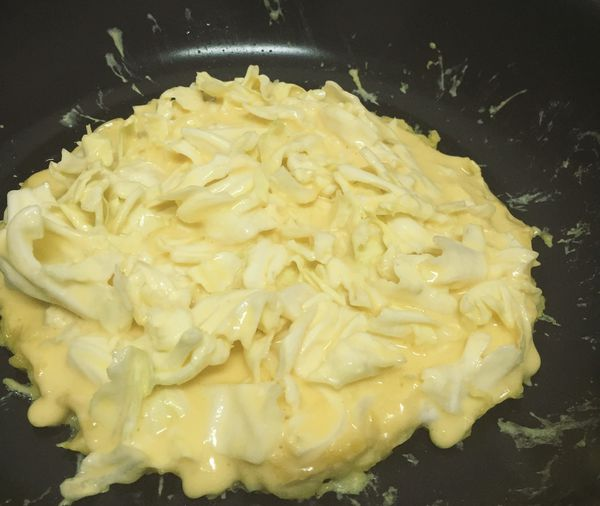
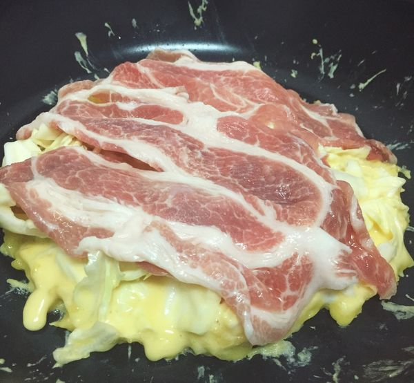
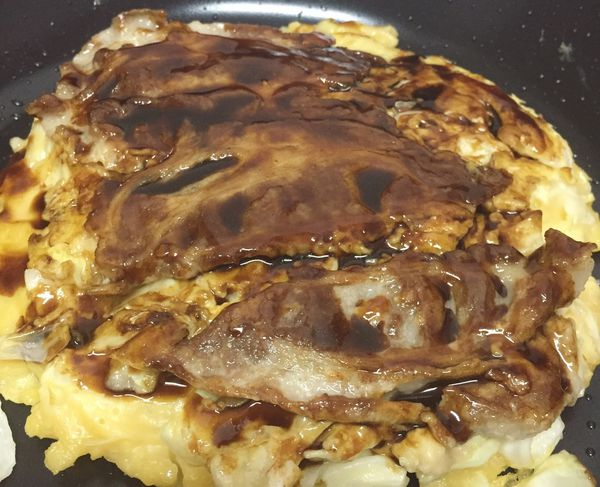
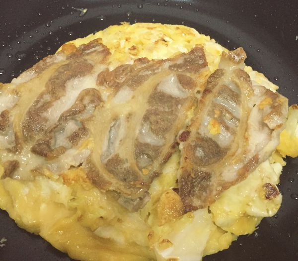
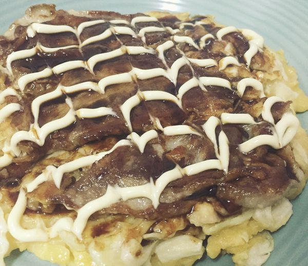

# 日式大阪燒

## 準備物品、食材:

• 麵粉，中筋低筋都可以 / 70 g

• 水 / 70 g

• 高麗菜 / 3～4 片

• 鰹魚粉（烹大師） / 1 小匙

• 鹽 / 1 小匙

• 雞蛋 / 1 顆

• 豬梅花肉片 / 3 片

• 日式伍斯特醬（日式炒麵醬\)  / 適量

• 日式美乃滋 / 適量

• 平底鍋 / 1 個

• 電磁爐 / 1 個

## 作法

### Step 1 :

  將高麗菜洗淨切碎，切成適合入口大小（太小的話口感不好，所以別切的太碎）

### Step 2 :

 將麵粉過篩，加入鰹魚粉、鹽，慢慢倒入水攪拌均勻，再打入雞蛋攪拌，最後將切好的高麗菜丟進去攪拌均勻即完成麵糊！（我不小心手殘水倒的有點多……煎的時候麵糊一直擴散＞＜上面水的分量是已經修改過的哦照那個分量作即可～）

### Step 3 :

 平底鍋熱鍋倒一點點油，下鍋煎啦！可用鏟子燒微將大阪燒整圓

### Step 4 :

 鋪上豬梅花肉片

### Step 5 :

 確定底部煎熟以後（一定要有煎熟，翻的時候才不容易碎掉），將鏟子鏟到底，快速一翻！就會得到完整的大阪燒～

### Step 6 : 

此時可以聽到豬梅花滋滋作響，油都被逼出來了，約煎個三分鐘後，再翻面檢查狀況，嗯～這種肉邊緣焦焦的狀態最好吃了！

###  Step 7 : 

熄火，擠上適量的伍斯特醬並塗抹均勻，最後在擠上美乃滋，若你喜歡的話，也可以灑上一些海苔粉跟柴魚片！

