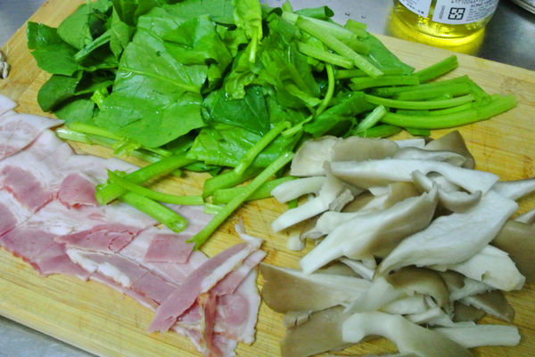
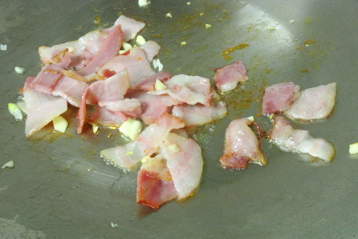
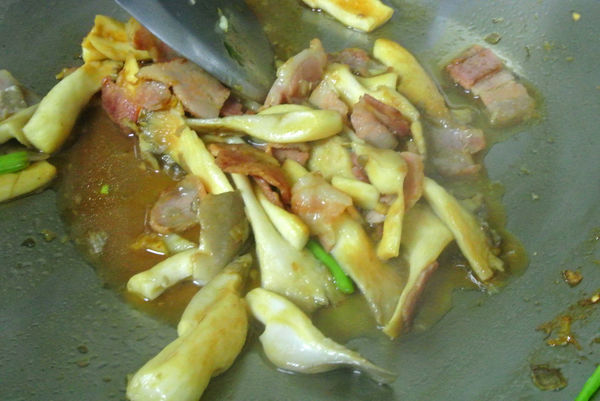

# 和風蔬菜培根義大利麵

## 準備物品、食材:

\( 兩人份 \)

• 培根  / 2 條 \( 換成自己喜歡的肉片也可以 \)

• 波菜  / 150 g

• 秀珍菇  / 8 ~10 朵 \( 換成喜歡的菇類也可以 \)

• 義大利麵  / 200 g

• 蒜頭  / 3 瓣

• 醬油  / 2 茶匙\( 可換成鰹魚或昆布等日式醬油 \)

• 味霖  / 2 茶匙

• 鹽  / 適量

• 黑胡椒  / 適量

• 平底鍋 / 1 個

• 電磁爐 / 1 個

## 作法

### Step 1 :

  義大利麵依照包裝上指示煮至熟,秀珍菇、波菜、培根切段、蒜頭拍碎切細

### Step 2 :

 培根放下鍋中乾煎,直到油被煎出來~~這時放入蒜頭拌炒至香味出現

### Step 3 :

 放入秀珍菇拌炒至半熟,倒入醬油跟味霖

### Step 4 :

 放入煮好的義大利麵與菠菜,用鹽和黑胡椒做最後的調味,拌炒到醬汁稍為收乾,波菜熟了就可以囉!

### Step 5 :

裝盤上菜!

簡簡單單就可以上菜吃午餐啦

日系的風味的義大利麵吃起來很特別

麵也可以換成烏龍麵等等的 

味道也會很搭喔

