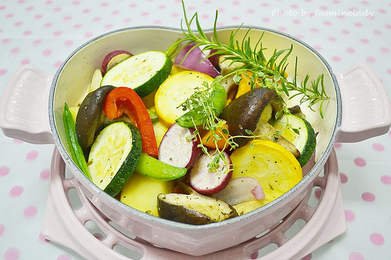

# 義式烤蔬菜

## 準備物品、食材:

\( 一人份 \)

• 耐烤的根莖類蔬菜 \( 菇類、洋蔥、瓜類、馬鈴薯 \) / 適量

• 橄欖油 / 少許

• 綜合義式香料粉 / 少許

• 黑胡椒粒 / 少許

• 鹽 / 少許

• 烤箱 / 1 個

## 作法

###  Step 1 :

把所有的蔬菜清洗後切片或切塊，盡量維持差不多的大小，大小一致烤出來的熟成度也會剛好差不多。

###  Step 2 :

切好的蔬菜全部放入一個大盆裡。

### Step 3 :

適量灑入義式香料粉、黑胡椒粒、海鹽。

###  Step 4 :

加入橄欖油，不要一次加太多，等下攪拌均勻的過程覺得不夠再慢慢一點一點加。

###  Step 5 :

將綜合蔬菜、調味料、橄欖油，攪拌均勻。  
盡量讓蔬菜的每一面都沾附到橄欖油，也不要因此一開始就先倒入過量的橄欖油，一邊拌勻，不夠再慢慢加，大致上，蔬菜表面有九成以上沾到橄欖油即可，因為有些蔬菜在烤熟的過程是會出水的，利用蔬菜的水份就不怕蔬菜烤焦。

### Step 6 :

烤箱預熱175度，放入烤箱烤30～40分鐘即可。（看你的蔬菜量多寡，請自行衡量）  
中途烤到香味飄出來的時候，可以拿出來用湯匙翻起拌一下，烤盤翻轉方向再放回去，這樣可以烤的更均勻。

###  Step 7 :

