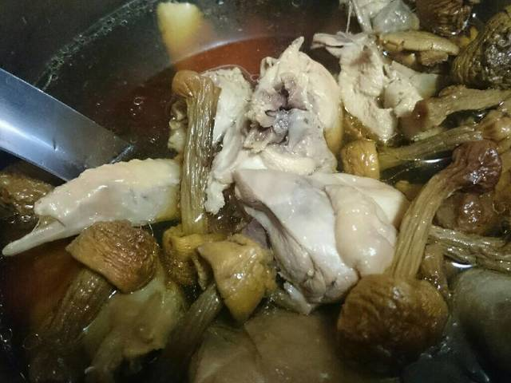

# 電鍋巴西蘑菇雞湯

## 準備物品、食材:

\( 1 ~ 3 人份 \)

• 雞肉\(切塊\) / 半隻

• 巴西蘑菇 / 3~4 兩

• 枸杞 / 少許

• 鹽巴 / 少許

• 電鍋 / 1 個

## 作法

### Step 1 :

巴西蘑菇稍清洗後，前一晚 先泡水放入冰箱，雞肉滾水燙好放冷藏。

### Step 2 :

早上出門前把所有料放內鍋，外鍋5杯水。

### Step 3 :

回家就可以享用了，不用加鹽也很好喝。

