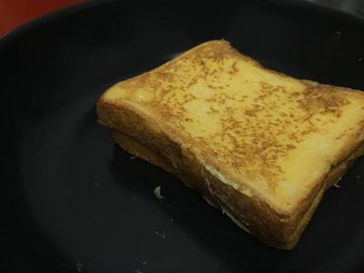

# 法式起司土司

## 準備物品、食材:

\(  一人份 \)

 • 土司 / 2 片         

• 起司片 / 1 片     

• 美乃滋 / 少許

• 雞蛋 / 1 顆          

• 奶油 / 少許     

• 電磁爐 / 1 個 

• 平底鍋 / 1 個

## 作法

### Step 1 :

將土司抹上一點美乃滋，夾入起司片，並讓土司沾滿蛋液

### Step 2 :

 平底鍋熱鍋加入一點奶油，下鍋煎，煎到兩面金黃微焦即可

### Step 3 :

