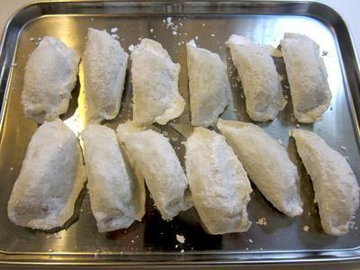
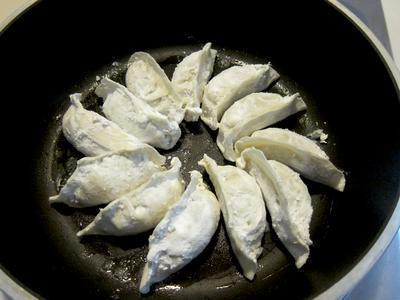
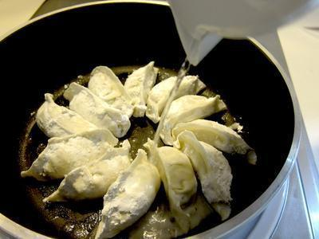
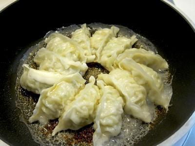

# 脆皮煎餃

## 準備物品、食材:

\( 一人份 \)

• 冷凍水餃 / 10 ~12 顆

• 沙拉油 / 1 大匙     

• 熱水 / 50 CC     

• 芝麻油 / 1 小匙 

• 電磁爐 / 1 個

• 平底鍋 / 1 個

## 作法

### Step 1 :

將冷凍水餃擺好，麵粉不要拍掉

### Step 2 :

倒入沙拉油熱油後慢慢擺入水餃

### Step 3 :

倒入500c.c熱水，並將水餃上的麵粉都沖掉，蓋上鍋蓋悶60分鐘左右

### Step 4 :

打開鍋蓋煎至水分蒸發 起鍋前淋下少量芝麻油

### Step 5 :

