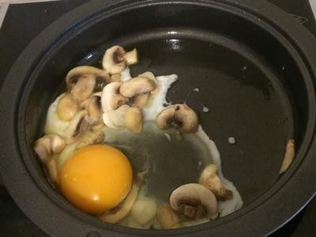

# 豬里肌總匯吐司

## 準備物品、食材:

\( 一人份 \)

• 吐司 / 2 片

• 苜宿芽 / 1 包

• 水煮蛋 / 1 顆     

• 蘑菇 / 3 顆  

• 胡椒 / 少許

• 牛番茄 / 半顆    

• 豬里肌肉排 / 1 片     

• 起司 / 1 片  

• 平底鍋 / 1 個

• 電磁爐 / 1 個

## 作法

### Step 1 :

番茄與磨菇切片

### Step 2 :

平底鍋加熱將吐司放入以煎代烤煎至酥脆並利用土司餘熱將起司融化。起鍋

### Step 3 :

倒入適量的油，將雞蛋與切片好的蘑菇一同放進鍋裏煎

### Step 4 :

### Step 5 :

